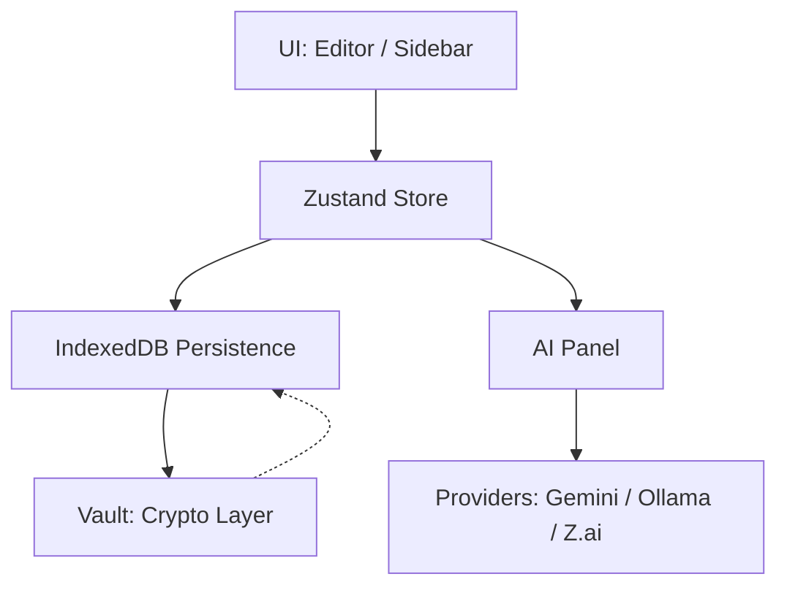

# Lumina-TXT: AI-Powered Local IDE

**Lumina-TXT** is a high-performance, local-first text editor and IDE designed for AI-driven workflows. It prioritizes data privacy, security, and developer productivity by keeping all your code and AI keys on your machine.

---

## 🌟 Key Features

- **🔐 Secure Vault**: Encrypt your sensitive API keys (e.g., Gemini) using AES-GCM 256-bit with PBKDF2 key derivation. Your keys never leave your browser in plaintext.
- **🧠 Multi-Provider AI**:
  - **Cloud**: Google Gemini (Direct API access).
  - **Local**: Ollama (Self-hosted models).
  - **Built-in**: Z-AI SDK orchestration.
- **📦 Local-First Architecture**: 100% of your data is stored in **IndexedDB**. No cloud syncing, zero external telemetry.
- **✍️ Modern Editor Core**: Custom-built editor with line numbers, Markdown formatting, word wrap, and session-persistence.
- **📂 Workspace Management**: Folder-based organization with support for multi-file projects and persona-overrides.

---

## 🏗️ Architecture



---

## 🛠️ Tech Stack

- **Framework**: [Next.js 16 (App Router)](https://nextjs.org/)
- **UI Architecture**: [React 19](https://react.dev/)
- **State Management**: [Zustand](https://github.com/pmndrs/zustand)
- **Styling**: [Tailwind CSS 4](https://tailwindcss.com/)
- **Database**: [Prisma](https://www.prisma.io/) + IndexedDB
- **Icons**: [Lucide React](https://lucide.dev/)
- **Runtime/PM**: [Bun](https://bun.sh/)

---

## 🚀 Getting Started

### Prerequisites
- [Bun](https://bun.sh/) installed on your machine.

### Setup
1.  Clone the repository and install dependencies:
    ```bash
    bun install
    ```
2.  Initialize the database:
    ```bash
    bun run db:push
    ```
3.  Start the development server:
    ```bash
    bun run dev
    ```

### Using Custom Scripts
Explore the `.zscripts/` directory for advanced build and deployment utilities:
- `./.zscripts/build.sh`: Production build workflow.
- `./.zscripts/start.sh`: Server orchestration.

---

## 🖋️ Contributing
Please read [CONTRIBUTING.md](CONTRIBUTING.md) for details on our code of conduct and the process for submitting pull requests.

## ⚖️ License
Lumina-TXT is licensed under the **MIT License**. See [LICENSE](LICENSE) for more details.

---
*Built with ❤️ for a private, AI-powered future.*
